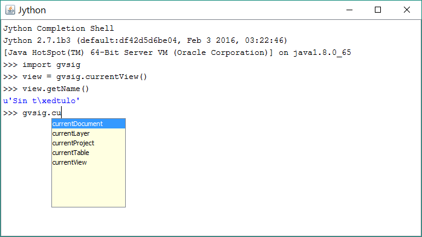
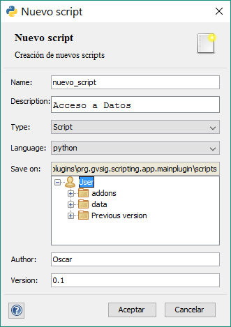

Introdução
===============

O que é o Módulo de Scripting
-----------------------------

O Módulo de Scripting é um módulo de programação totalmente integrado no gvSIG 2.

Este módulo foi integrado a partir das versões 2.x do gvSIG, e teve importantíssimas melhoras no gvSIG 2.3.

O que você precisa
------------------

Para seguir este guia somente é necessário ter instalado a versão do gvSIG 2.3. O Scripting Framework ou Módulo de Scripting veem instalados por padrão.

A última versão disponível de gvSIG 2 pode ser encontrado em:
http://www.gvsig.com/es/productos/gvsig-desktop/descargas

Também será necessário ter instalado o pacote de **Scripting Composer Tools**. Este pacote é um conjunto de ferramentas desenvolvida para facilitar a tarefa do desenvolvedor. Inclui ferramentas de auto completar, código navegador, a ferramenta de interfaces visuais Abeille, entre outros. Pode ser instalado diretamente a partir do **Administrador de Complementos**.

Para a sua instalação ir até o menu:`Ferramentas --> Administrador de Complementos` e selecione ``Instalação padrão``.

.. figure::  images/inst_1.png
   :align:   center

Em filtro rápido digite **Composer Tools**:

.. figure::  images/inst_2.png
   :align:   center

Quando a instalação finalizar vá em:`Ferramentas --> Scripting --> Editor de Scripts`, onde podemos comprovar se aparece a pasta ``ScriptingComposerTools`` e se foi instalada corretamente.

.. figure::  images/inst_3.png
   :align:   center

É necessário reiniciar gvSIG para seu uso. Se voltarmos a abrir o Editor de Scripts, veremos que aparecem uma série de botões extra na barra de Ferramentas:

O que é possível fazer
----------------------

Este módulo de programação nos dará a oportunidade de programar nossas próprias ferramentas e extensões para o gvSIG.

Os scripts podem ser modificados, adaptados, trocados e desenvolvidos de uma maneira muito fácil, e o mais importante, rapidamente.
Uma das vantagens é devido à facilidade da linguagem Python, não será necessário ter extensos conhecimentos de programação nem de como funciona a arquitetura do gvSIG para poder desenvolver a ferramenta que necessitamos.

As possibilidades são infinitas, nos permitirá:
- Automatizar tarefas
- Adicionar funcionalidades
- Criar novos geoprocessos
- Personalizar gvSIG
- Criação de extensões (Plugins)
- Uso da API de gvSIG: tratamento espaciais, conexões de dados, geração de mapas, etc.

Qual a linguagem que utilizamos
-------------------------------

A linguagem principal que temos utilizado para o desenvolvimento é Jython `<http://www.jython.org/>`_, embora também se pode executar scripts em Groovy, R..

**Jython é uma implementação de Python realizada em Java.**

Esta implementação nos permite trabalhar com a API do gvSIG (aplicação realizada em Java) usando scripts utilizando a sintaxe de Python, facilitando muito o desenvolvimento e execução destes, precisando apenas ter instalado o gvSIG para poder programar.

Isto nos dá algumas vantagens enormes, por um lado, Python é uma linguagem muito simples de aprender, por outro lado, não é necessária a compilação previa com um IDE externo, sendo que a compilação do código se realiza no momento da execução, cada vez que executamos nosso script. Isto nos permite realizar modificações em nossos script e ir testando enquanto o gvSIG estiver aberto.

Também, tem compatibilidade com muitas das bibliotecas de Python existentes, e todas (ou maioria) de Java.

Como acessar o Módulo de criação de Scripting
---------------------------------------------
Uma vez instalado gvSIG 2 já podemos abri-lo. Para acessar este módulo de programação será através do menu:`Ferramentas --> Scripting`. Aqui nos encontraremos 3 opções:

Lançador de Scripts
++++++++++++++++++

.. figure::  images/scripting_launcher.png
   :align:   center
   
Se trata de um lançador de scripts, uma lista com acessos diretos aos nossos scripts.
Conforme vamos criando e armazenando nossos scripts, a nossa lista vai sendo atualizada e accessível para executar um script que necessitemos em qualquer momento, com um duplo clique. É muito cômodo preparamos scripts para executá-los enquanto estamos trabalhando, uma forma rápida de tê-los em qualquer momento.

Editor de Scripts
++++++++++++++++++

.. figure::  images/scripting_composer.png
   :align:   center

Esta é a tela principal deste módulo. Aqui poderemos criar, organizar e armazenar todos os nossos scripts.

Os ícones principais: Novo, Abrir, Salvar, Salvar e Executar, Fechar.. Depois de criarmos um arquivo novo poderemos escrever nosso código.

A execução do script aparecerá refletida no terminal que se situa na parte inferior,

Terminal Jython
++++++++++++++

   
É um terminal que nos permitirá executar o código diretamente, executando-o linha por linha. Nos permite consultar variáveis e ver como estão sendo modificadas.

Outra função interessante é que nos oferece também uma ajuda dos comandos que estão disponíveis segundo o código que estejamos escrevendo, ou de que tipo de métodos estão disponíveis nas diferentes classes do gvSIG.

Bibliotecas do gvSIG para Scripting
---------------------------------

Foi criada uma biblioteca escrita em Jython denominada ``gvsig``. Sua função é injetar métodos extras nas classes de Java já existentes na API do gvSIG e ampliar através de novas funções o potencial e a facilidade de uso deste módulo.

Seu objetivo é diminuir o número de linhas requeridos para realizar certas operações e fazer acessível a API do gvSIG de uma maneira mais simples a partir do Jython.

A bibliotecas Javas que compõem o gvSIG estão totalmente acessíveis a partir dos nossos scripts em Jython, sendo possível, sem nenhuma restrição, o acesso a elas e a criação de extensões, da mesma forma que se fizéssemos isso diretamente em Java.

Organização da biblioteca gvsig
---------------------------------

O Módulo de Scripting vem con diversas bibliotecas:

- ``gvsig``: pertencem as funções principais do gvSIG, principalmente para o acesso e manipulação de dados. Contém funções úteis e os métodos injetados nas classes do gvSIG. Também contém os outros módulos que explicamos.
- ``gvsig.commonsdialog``: encarregada da geração de janelas, desde mensagens de alertas até o caminho para arquivos.
- ``gvsig.geom``: contém todas as funções relacionadas com as geometrias.

Além disso, incluímos outras classes importantes que nos ajudarão na geração dos scripts:

- ``gvsig.libs.formpanel.FormPanel``: Esta classe nos ajudará na geração de scripts com interfaces visuais
- ``gvsig.libs.gvpy``: Biblioteca para a execuçaõ de geoprocessos a partir de Scripting
- ``gvsig.libs.toolbox.ToolboxProcess``: Classe para a criação de geoprocessos que serão adicionados à Toolbox e poderão ser utilizados a partir do Modelador.
- ``gvsig.libs.load_project.load_project()``: Função para abrir um projeto no gvSIG a partir de um arquivo
- etc

É recomendável importar apenas as bibliotecas necessárias para a execução do script.

Se o nosso script contém outras bibliotecas própiras que também programamos, ao realizar sua importação podemos forçar a recarga destas bibliotecas (se não as alterações não aparecerão) utilizando a função `reload()`. Essa é a forma correta de fazer isso::

    import lib
    reload(lib)

Criação de um script
---------------------

.. |new| image:: images/icon-new.png

Para criar um script novo, trabalharemos no **Editor de Scripts**. Pressione no ícone "Novo" |new| situado acima à esquerda, ou em :menuselection:`Arquivo --> Novo` e será aberta uma janela perguntando qual o tipo de script a criar.

   
Nesta janela devemos escrever o nome e a descrição do que iremos criar. Como tipo de arquivo podemos escolher qual tipo de script iremos criar. As opções sãoa:

- Script: Programa com código em linha que poderemos executar.
- Dialog: Programa com código e uma interface visual. (Não recomendado, para scripts com interface visual usaremos também o tipo script)
- Project: Ainda não habilitado, para futuras versões.
- Folder: Cria uma pasta em nossa lista de "Scripts de usuário".

Podemos selecionar a linguagem de programação com a qual prefiramos trabalhar. As linguagens suportadas são:
- ECMAScript
- Python (na qual temos centralizado o desenvolvimento)
- Groovy
- R
- Scala

.. figure::  images/nuevo_script_lenguajes.png
   :align:   center

Em ``Save on`` poderemos escolher em qual pasta salvaremos nosso novo script. As duas últimas caixas de texto servem para inserir informações sobre o Autor e a Versão.

Clicamos em "Aceitar". Isso irá criar o nosso novo script em branco, que aparecerá aberto para edição. Veremos que aparece novo em nossa listagem de scripts de usuário e abre-se uma aba com o nome do scritp. Nesta aba um asterisco aparecerá indicando se o script contém alterações que não foram salvas. Abaixo aparece o nosso código, que por padrão traz uma tela com a estrutura básica, e por baixo de tudo encontramos a saída pelo terminal.

Os scripts criados são armazenados na seguinte pasta do gvSIG (Windows) ``C:\Users\*\gvSIG\plugins\org.gvsig.scripting.app.extension``. De forma similar na pasta ``/home/`` do Linux.
Agora podemos escrever nosso primeiro script. O exemplo que aparece por padrão é totalmente válido:

.. code-block:: python
    :linenos:
    :emphasize-lines: 5
    :caption: primer_script.py
    :name: primer-script

    # encoding: utf-8

    import gvsig

    def main(*args):

        #Remove this lines and add here your code

        print "Olá mundo"
        pass

Primeiramente, realiza uma importação da biblioteca que iremos utilizar, a biblioteca de scripting ``gvsig``, e em seguida define dentro da função principal main(), o comando print que fará sair nosso valo no terminal.

.. figure::  images/scripting_composer_2.png
   :align:   center

Dentro do Scripting no gvSIG, a função que será executado por padrão **será sempre a função main()**, sendo assim, deveremos sempre introduzir todo o nosso código nessa função.

.. note::

   Todos nossos scripts devem conter a função main() para sua correta execução. Não será obrigatório se serão usados como bibliotecas.

.. |saveandexecute| image:: images/icon-saveandexecute.png
.. |save| image:: images/icon-save.png
.. |execute| image:: images/icon-execute.png

Para executar um script salvamos |save| e executamos |execute| ou clicamos diretamente no ícone |saveandexecute| e veremos sua execução no terminal.

Podemos comprovar que a salida no terminal é "Olá mundo", sendo este o objetivo que buscávamos. Com isso, executamos o nosso primeiro scrip com sucesso.

Esta estrutura é a estrutura básica de un script no gvSIG 2.3. 

Se abrirmos agora o Lançador de Sripts, no menu de Scripting, veremos que já aparece nosso script na nova listagem.

Se queremos comprovar nossos scripts no HD estarão na pasta:

- Em uma versão instalável no Windows: ``C:\Users\NomeUsuario\gvSIG\plugins\org.gvsig.scripting.app.extension\scripts``

- Em uma versão portátil no Windows: ``\gvSIG_pasta_instalacao\home\gvSIG\plugins\org.gvsig.scripting.app.extension\scripts``

Ao abrirmos esta pasta podemos copiar e colar os scripts, atentando em copiar ambos arquivos ``.py`` e ``.inf``.

.. note::

    O recomendável é gerar os scripts dentro da sua própria pasta. Isto nos permitirá usá-los como módulos, dando-nos várias opções: usar arquivos autorun.py (autoexecutáveis ao iniciarmos o gvSIG), arquivo __init__.py (nos permitirá trabalhar como se fosse um módulo, permitindo-nos importar bibliotecas que estejam na mesma pasta) e a criação de pacotes de Scripts.

Gerando pacotes de scripts
-----------------------------

Uma vez tenhamos criado um script em sua própia pasta com todo o necessário, podemos gerar un pacote do gvSIG ``.gvspkg`` para enviá-lo ou subí-lo. Com este pacote podemos **realizar a instalação do script a partir do Gerenciador de Complementos**. Seu uso é muito intuitivo.

A ferramenta se encontra no Editor de Script, no menu :menuselection:`Ferramentas --> Pacote de script`.

Selecionamos a pasta que contém nossa extensão:

.. figure::  images/empaquetador_1.png
   :align:   center

Definimos as propiedades do pacote:

.. figure::  images/empaquetador_2.png
   :align:   center

As opções de saída:

O caminho será semelhante a este: ``gvSIG-desktop-2.3.0-2441-RC2-win-x86_64\install\gvSIG-desktop-2.3.0-ExportadorCapas-1.0.0-0-testing-all-all-j1_7.gvspkg``. 

.. figure::  images/empaquetador_3.png
   :align:   center
   
Ao finalizar, já aparecerá nossa extensão no formato ``.gvspkg``, que pode ser instalada a partir do Gerenciador de Complementos

.. figure::  images/empaquetador_4.png
   :align:   center

