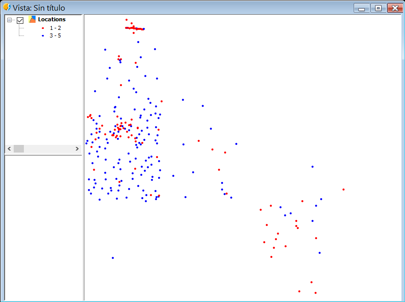

Legendas
========

Em camadas vetoriais
--------------------

Podemos criar e designar legendas e camadas vetoriais.

Um exemplo é a criação de uma legenda de intervalos para uma camada de pontos::

	# encoding: utf-8

	from gvsig import *
	from gvsig import geom
	from java.awt import Color
	from org.gvsig.symbology.fmap.mapcontext.rendering.legend.impl import VectorialIntervalLegend

	def main(*args):
		""" Criar legentda de intervalo """
			
		vil = VectorialIntervalLegend(geom.POINT)
		
		vil.setStartColor(Color.red)
		vil.setEndColor(Color.blue)
		vil.setIntervalType(1)
		store = currentLayer().getFeatureStore()
		ii = vil.calculateIntervals(store, "size", 5, geom.POINT) 
		
		vil.setIntervals(ii)
		
		currentLayer().setLegend(vil)
		
Podemos ver os diferentes parâmetros que suporta :javadoc:`VectorialIntervalLegend <VectorialIntervalLegend>`. São estabelecidos a cor de início e a de final, um tipo de intervalo, e o número de intervalos que queremos.

Com 2 intervalos:

   
Com 5 intervalos:

   
Gerando símbolos para camadas vetoriais::

	# encoding: utf-8

	import gvsig
	from java.awt import Color
	from org.gvsig.fmap.mapcontext import MapContextLocator

	def main(*args):
		""" Legenda: Criando pontos """
		#p1 = gvsig.simplePointSymbol()
		print gvsig.utils.COLORS
		
		p1 = gvsig.simplePointSymbol("green")
		p2 = gvsig.simplePointSymbol(gvsig.utils.COLORS["green"])
		print "simplePointSymbol Green: ", p2

		sp = MapContextLocator.getSymbolManager().getSymbolPreferences()
		color = sp.getDefaultSymbolFillColor()
		print "color: ", color

		##
		y = MapContextLocator.getSymbolManager()#.isDefaultSymbolFillColorAleatory()
		v = MapContextLocator.getMapContextManager()
		print "mapcontext: ",v
		print "defaultSymbolFillColorAleatory: ", v.isDefaultSymbolFillColorAleatory()

		xx = gvsig.getDefaultColor()
		print "getDefaultColor: ", xx

		yy = gvsig.simplePointSymbol()
		print "simplePointSymbol: ", yy

		zz = gvsig.simpleLineSymbol()
		print "simpleLineSymbol: ", zz

		uu = gvsig.simplePolygonSymbol()
		print "simplePolygonSymbol: ", uu
		
		
Camada de Graphics Layer
------------------------

Exemplo para criar uma camada de graphicslayer, esta camada se situa por cima das demais em nossa Vista::

    # encoding: utf-8

    from gvsig import *
    from gvsig.geom import *
    import random

    def main(*args):
        vista=currentView()
        gp = vista.getGraphicsLayer()
        gp.removeGraphics("ejemplo")

        features = currentLayer().features()
        for feature in features:
            pol = feature.geometry()
            r = lambda: random.randint(0, 255)
            color = getColorFromRGB(r(), r(), r() ,r())
            polSymbol = simplePolygonSymbol(color)
            idPolSymbol = gp.addSymbol(polSymbol)
            gp.addGraphic("ejemplo", pol,  idPolSymbol, "Label")
            
.. figure::  images/graphicslayer_1.png
   :align:   center
