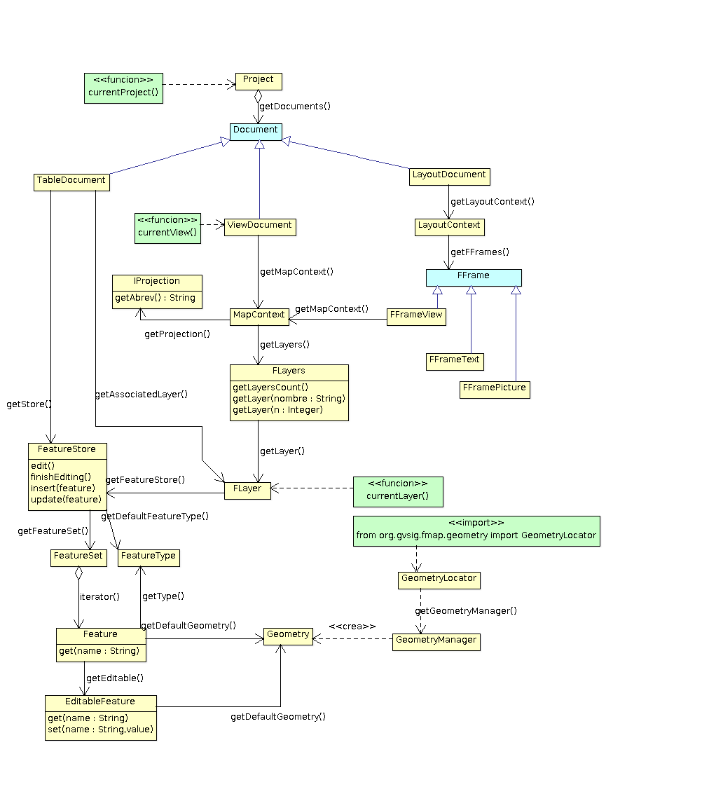
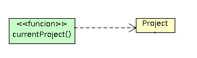

Modelo de objetos simplificado
==============================

Aqui podemos ver um esquema com os componentes de uso mais comum desde scripting, a relação entre eles e como podemos acessar a eles a partir do nosso script. Além disso, podemos navegar até a navegação da classe Java clicando sobre o componente.
	  
.. note::

	Desenvolvedores Java e usuários com conhecimentos sobre UML: O diagrama e comentários estão pensados para que seja o mais entendível possível para um usuário sem conhecimentos de java ou de UML, não para ser estrito à nomeclatura UML.

.. raw:: html

    
    <map name="map">
      <!-- #$-:Image map file created by GIMP Image Map plug-in -->
      <!-- #$-:GIMP Image Map plug-in by Maurits Rijk -->
      <!-- #$-:Please do not edit lines starting with "#$" -->
      <!-- #$VERSION:2.3 -->
      <!-- #$AUTHOR:Joaquin del Cerro Murciano --> 
	  <area shape="rect" coords="328,96,411,136" href="http://downloads.gvsig.org/download/gvsig-desktop-testing/dists/2.3.0/javadocs/html/org/gvsig/app/project/Project.html">
      <area shape="rect" coords="326,169,406,216" href="http://downloads.gvsig.org/download/gvsig-desktop-testing/dists/2.3.0/javadocs/html/org/gvsig/app/project/documents/Document.html">
      <area shape="rect" coords="315,303,427,346" href="http://downloads.gvsig.org/download/gvsig-desktop-testing/dists/2.3.0/javadocs/html/org/gvsig/app/project/documents/view/ViewDocument.html">
      <area shape="rect" coords="324,433,416,474" href="http://downloads.gvsig.org/download/gvsig-desktop-testing/dists/2.3.0/javadocs/html/org/gvsig/fmap/mapcontext/MapContext.html">
      <area shape="rect" coords="325,516,498,605" href="http://downloads.gvsig.org/download/gvsig-desktop-testing/dists/2.3.0/javadocs/html/org/gvsig/fmap/mapcontext/layers/FLayers.html">
      <area shape="rect" coords="316,683,390,719" href="http://downloads.gvsig.org/download/gvsig-desktop-testing/dists/2.3.0/javadocs/html/org/gvsig/fmap/mapcontext/layers/FLyrDefault.html">
      <area shape="rect" coords="38,629,156,733" href="http://downloads.gvsig.org/download/gvsig-desktop-testing/dists/2.3.0/javadocs/html/org/gvsig/fmap/dal/feature/FeatureStore.html">
      <area shape="rect" coords="69,777,152,813" href="http://downloads.gvsig.org/download/gvsig-desktop-testing/dists/2.3.0/javadocs/html/org/gvsig/fmap/dal/feature/FeatureSet.html">
      <area shape="rect" coords="166,779,260,815" href="http://downloads.gvsig.org/download/gvsig-desktop-testing/dists/2.3.0/javadocs/html/org/gvsig/fmap/dal/feature/FeatureType.html">
      <area shape="rect" coords="75,891,216,953" href="http://downloads.gvsig.org/download/gvsig-desktop-testing/dists/2.3.0/javadocs/html/org/gvsig/fmap/dal/feature/Feature.html">
      <area shape="rect" coords="62,990,228,1061" href="http://downloads.gvsig.org/download/gvsig-desktop-testing/dists/2.3.0/javadocs/html/org/gvsig/fmap/dal/feature/EditableFeature.html">
      <area shape="rect" coords="372,894,450,925" href="http://downloads.gvsig.org/download/gvsig-desktop-testing/dists/2.3.0/javadocs/html/org/gvsig/fmap/geom/Geometry.html">
      <area shape="rect" coords="566,811,693,844" href="http://downloads.gvsig.org/download/gvsig-desktop-testing/dists/2.3.0/javadocs/html/org/gvsig/fmap/geom/GeometryLocator.html">
      <area shape="rect" coords="555,900,686,936" href="http://downloads.gvsig.org/download/gvsig-desktop-testing/dists/2.3.0/javadocs/html/org/gvsig/fmap/geom/GeometryManager.html">
      <area shape="rect" coords="40,242,162,279" href="http://downloads.gvsig.org/download/gvsig-desktop-testing/dists/2.3.0/javadocs/html/org/gvsig/app/project/documents/table/TableDocument.html">
      <area shape="rect" coords="579,235,704,266" href="http://downloads.gvsig.org/download/gvsig-desktop-testing/dists/2.3.0/javadocs/html/org/gvsig/app/project/documents/layout/LayoutDocument.html">
      <area shape="rect" coords="588,309,693,341" href="http://downloads.gvsig.org/download/gvsig-desktop-testing/dists/2.3.0/javadocs/html/org/gvsig/app/project/documents/layout/LayoutContext.html">
      <area shape="rect" coords="606,380,747,416" href="http://downloads.gvsig.org/download/gvsig-desktop-testing/dists/2.3.0/javadocs/html/org/gvsig/app/project/documents/layout/fframes/FFrame.html">
      <area shape="rect" coords="547,437,640,472" href="http://downloads.gvsig.org/download/gvsig-desktop-testing/dists/2.3.0/javadocs/html/org/gvsig/app/project/documents/layout/fframes/FFrameView.html">
      <area shape="rect" coords="654,540,760,576" href="http://downloads.gvsig.org/download/gvsig-desktop-testing/dists/2.3.0/javadocs/html/org/gvsig/app/project/documents/layout/fframes/FFramePicture.html">
      <area shape="rect" coords="604,502,691,533" href="http://downloads.gvsig.org/download/gvsig-desktop-testing/dists/2.3.0/javadocs/html/org/gvsig/app/project/documents/layout/fframes/FFrameText.html">
    </map>
	

Como interpretar o diagrama
++++++++++++++++++++++++++++

No diagrama anterior podemos ver:

- **Caixas em amarelo**, que representam os objetos que podemos encontrar e com os quais podemos trabalhar.
- **Caixas em verde**, nos indicam ações que podemos realizar a partir de nosso script. Por exemplo, podemos ver:

   
Deve ser interpretado como tendo disponível uma **função**, ``currentProject()``, que podemos executar desde nosso script para obter o objeto com o qual está relacionada, neste caso o **project**. Para os elementos etiquetados como **função** precisaremos ter importado o módulo ``gvsig``::

    from gvsig import *

- **Caixas em azul**, nos indica que se trata de uma entidade abstrata. Nunca encontraremos objetos deste tipo. Fazem referência de forma genérica a um grupo de objetos com características comuns; por exemplo, teremos um :javadoc:`Document <Document>` que agrupa as características comuns de :javadoc:`ViewDocument <ViewDocument>`, :javadoc:`TableDocument <TableDocument>` ou :javadoc:`LayoutDocument <LayoutDocument>`. No diagrama podemos encontrar, por exemplo:

.. figure::  images/interpretar-herencia.png
   :align:   center
   
Aqui temos uma entidade :javadoc:`FFrame <FFrame>` abstrata, nunca encontraremos objetos deste tipo, o que encontraremos serão objetos do tipo :javadoc:`FFrameView <FFrameView>`, :javadoc:`FFramePicture <FFramePicture>` ou :javadoc:`FFrameText <FFrameText>`, e nos indica que todos os objetos concretos relacionados con :javadoc:`FFrame <FFrame>` terão um conjunto de atributos e operações comuns.

- **Associações entre objetos**, que nos indicam que a partir de um objeto podemos obter outro ou um conjunto de outros. Por exemplo:

.. figure::  images/interpretar-asociacion.png
   :align:   center

Nos demonstra que se dispomos de um objeto :javadoc:`LayoutDocument <LayoutDocument>`, podemos obter o objeto :javadoc:`LayoutContext <LayoutContext>` invocando a operação ou método ``getLaypoutContext``::

	laypoutContext = layoutDocument.getLaypoutContext()
