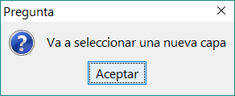
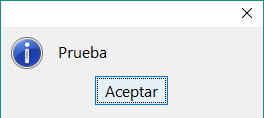
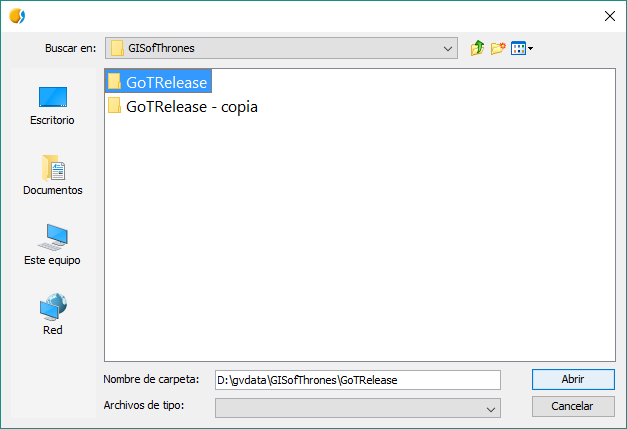

Módulo commonsdialog
====================

Funções principais
---------------------

.. py:function:: msgbox(message[,title="", meesageType=IDEA, root=None])

    Mostra uma mensagem de diálogo apenas com um botão de Ok.

    :param str message: texto a ser apresentado no diálogo
    :param str title: título do diálogo
    :param int messageType: tipo de ícone a ser usado.
    :param root: Frame reference
    :type root: DefaultFrame ou None

.. py:function:: inputbox(message, [title="", messageType=IDEA, initialValue="", root=None])

    Mostra um diálogo de entrada.

    :param str message: texto a ser apresentado no diálogo
    :param str title: título do diálogo
    :param int messageType: tipo de ícone a ser usado.
    :param str initialValue: Valor inicial da caixa de entrada
    :param root: Frame reference
    :type root: DefaultFrame ou None
    :return: Texto retornado na caixa de entrada
    :rtype: str

.. py:function:: confirmDialog(message, [title="", optionType=YES_NO, messageType=IDEA, root=None])

    Cria uma mensagem de diálogo com botões de opção

    :param str message: texto a ser apresentado no diálogo
    :param str title: título do diálogo
    :param int optionType: botões a serem mostrados
    :param int messageType: tipo de ícone a ser usado.

.. py:function:: filechooser(option, [title="", initialPath=None, multiselection=False, filter = None, fileHidingEnabled=True, root=None])

	Permite configurar os parâmetros de diálogos de seleção de arquivos

    :param int option: modo de seleção do seletor de arquivos. Valores permitidos: OPEN_FILE, OPEN_DIRECTORY, SAVE_FILE
    :param str title: Título da janela
    :param str initialPath: Caminho inicial para o diretório a ser aberto no diálogo
    :param boolean multiselection: Permite a seleção de mais de um objeto.
    :param filter: lista de extensões de arquivos aceitados ("jpg", "png", "gif")
    :type filter: List of Strings
    :param boolean fileHidingEnabled: True se arquivos ocultos não serão mostrados
    :return: Caminho selecionado ou lista de caminhos

.. py:function:: openFileDialog([title='', initialPath=None, root=None])

	Mostra uma janela de diálogo para escolha de um arquivo.

    :param str title: Título da janela. Default ''
    :param str initialPath: Caminho inicial a ser aberto na janela de diálogo

.. py:function:: openFolderDialog([title='', initialPath=None, root=None])

    Mostra uma janela de diálogo para escolha de uma pasta.

    :param str title: Título da janela. Default ''
    :param str initialPath: Caminho inicial a ser aberto na janela de diálogo

.. py:function:: saveFileDialog([title='', initialPath=None, root=None])

    Mostra uma janela de diálogo para escolha de um arquivo.

    :param str title: Título da janela. Default ''
    :param str initialPath: Caminho inicial a ser aberto na janela de diálogo

.. py:function:: getJavaFile(path)

    Retorna um java File usando um caminho como parâmetro. Se o caminho não existir, procura na pasta do usuário e, se não encontrá-lo, retorna o caminho que será o diretório de instância do gvSIG.

    :param str path: String-path.
    :return: Retorna java.io.File

Constantes na biblioteca
-------------------------
Constantes que aparecem na biblioteca e serão usadas em diferentes funções::

	*messageType options*
	FORBIDEN = 0
	IDEA= 1
	WARNING= 2
	QUESTION= 3

	*Confirmdialog optionType Options*
	YES_NO = 0
	YES_NO_CANCEL = 1
	ACEPT_CANCEL = 2

	YES = 0
	NO = 1
	CANCEL = 2

	*filechooser options*
	OPEN_FILE = 0
	OPEN_DIRECTORY = 1
	SAVE_FILE = 2

	*filechooser selectionMode*
	FILES_ONLY = JFileChooser.FILES_ONLY
	DIRECTORIES_ONLY = JFileChooser.DIRECTORIES_ONLY

Uso
---

 Com o módulo de commonsdialog gerenciamos as janelas popup que aparecem no gvSIG. Por exemplo, se queremos mostrar um aviso ao usuário usaremos :py:func:`msgbox`: ou se precisamos que o usuário entre com algum valor que será usado no script, podemos usar a função :py:func:`inputbox` que devolverá o texto que for escrito pelo usuário na caixa de texto que aparecerá na tela.

Para importar a biblioteca faremos o seguinte::

	import gvsig.commonsdialog
	
ou::

	from gvsig import commonsdialog
	
ou::

	from gvsig.commonsdialog import *
	

	
Por exemplo:

.. code-block:: python
	:linenos:
	:emphasize-lines: 1, 5
	
	from gvsig import commonsdialog

	def main(*args):

		commonsdialog.msgbox("Bem vindo ao gvSig","Welcome", commonsdialog.IDEA)

O tipo de mensagem é estabelecido no parâmetro ``messageType`` como podemos ver em :py:func:`msgbox` e estes tipos ficam armazenados em constantes dentro do módulo ``commonsdialog``.

Ou depende de como realizamos a importação.

.. code-block:: python
	:linenos:
	:emphasize-lines: 1, 5
	:caption: msgbox.py
	:name: msgbox-commonsdialog
	
	from gvsig.commonsdialog import *

	def main(*args):

		msgbox("Bem vindo ao gvSIG", "Welcome", IDEA)
		
Dando como resultado uma janela:

.. figure::  images/commonsdialog-msgbox_1.png
   :align:   center

Dependendo do tipo de aviso que selecionemos serão mostrados diferentes ícones na janela:

WARNING:

.. figure::  images/commonsdialog-msgbox_2.png
   :align:   center
   
FORBIDEN:

.. figure::  images/commonsdialog-msgbox_3.png
   :align:   center
   
QUESTION:

   
   
Tipos de diálogos
-----------------

Diferentes tipos de diálogos::

	from gvsig import *
	from gvsig import commonsdialog
	from gvsig.commonsdialog import *

	def main(*args):
		
		message = "Prueba"
		
		mb = commonsdialog.msgbox(message, title="", messageType=IDEA, root=None)
		print "msgbox:", mb

		ib = commonsdialog.inputbox(message, title="", messageType=IDEA, initialValue="", root=None)
		print "inputbox:", ib

		cd = commonsdialog.confirmDialog(message, title="", optionType=YES_NO, messageType=IDEA, root=None)
		print "confirmDialog:", cd

		option = "OPEN_FILE"
		fc = commonsdialog.filechooser(option, title="", initialPath=None,  multiselection=False, filter = None, fileHidingEnabled=True, root=None)
		print "filechooser:", fc

		fc = commonsdialog.filechooser(option, title="", initialPath=None,  multiselection=True, filter = None, fileHidingEnabled=True, root=None)
		print "filechooser:", fc

		ofiled = commonsdialog.openFileDialog(title='', initialPath=None, root=None)
		print "openFileDialog:", ofiled

		ofolderd = commonsdialog.openFolderDialog(title='', initialPath=None, root=None)
		print "openFolderDialog:", ofolderd
		
		sfd = commonsdialog.saveFileDialog(title='', initialPath=None, root=None)
		print "saveFileDialog:",sfd

Caixa de mensagem:

Caixa de entrada de texto:

.. figure::  images/c_inputbox.png
   :align:   center
   
Diálogo de Confirmação:

.. figure::  images/c_confirmDialog.png
   :align:   center
		
Seletor de arquivos:

.. figure::  images/c_1.png
   :align:   center
		
Seletor de arquivos com múltipla seleção:

.. figure::  images/c_2.png
   :align:   center
   
Diálogo de abertura de arquivo:

.. figure::  images/c_3.png
   :align:   center
   
Diálogo de abertura de pasta:

   
Diálogo para salvar arquivo:

.. figure::  images/c_5.png
   :align:   center

Saída pelo terminal::

	msgbox: None
	inputbox: 
	confirmDialog: 0
	filechooser: D:\gvdata\countries027.geojson
	filechooser: [u'D:\\gvdata\\countries024.geojson', u'D:\\gvdata\\countries025.geojson', u'D:\\gvdata\\countries026.geojson',
				u'D:\\gvdata\\countries027.geojson', u'D:\\gvdata\\countries028.geojson', u'D:\\gvdata\\countries029.geojson',
				u'D:\\gvdata\\countries030.geojson']
	openFileDialog: [u'D:\\gvdata\\countries028.geojson']
	openFolderDialog: [u'D:\\gvdata\\GISofThrones\\GoTRelease']
	saveFileDialog: [u'D:\\gvdata\\newfile.shp']
